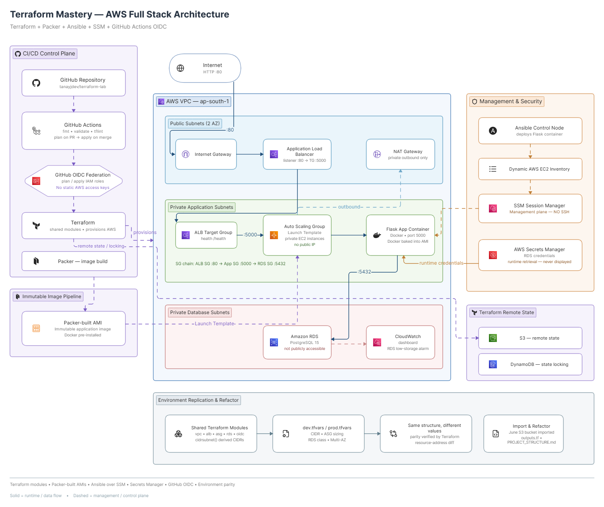

# terraform-lab — Full AWS Infrastructure as Code

<p align="center">
  
  
  
  
  
  
</p>

<p align="center">
  <strong>Terraform + Packer + Ansible + AWS + GitHub Actions</strong><br/>
  Modular infrastructure, immutable images, zero-SSH configuration management, secure CI/CD, and measurable environment replication.
</p>

<p align="center">
  <a href="#architecture">Architecture</a> •
  <a href="#what-is-built">What Is Built</a> •
  <a href="#environment-replication">Environment Replication</a> •
  <a href="#security-practices">Security</a> •
  <a href="#repository-structure">Repository Structure</a> •
  <a href="#run-it-yourself">Run It</a> •
  <a href="#verification">Verification</a>
</p>

---

## Overview

This repository is my Infrastructure-as-Code implementation of an AWS application platform, built progressively throughout August 2026.

It evolved from manually assembled AWS infrastructure into a code-defined system built around:

- **Terraform** for infrastructure provisioning and module composition
- **Packer** for immutable EC2 AMI creation
- **Ansible** for application configuration and deployment
- **AWS Systems Manager Session Manager** instead of SSH
- **AWS Secrets Manager** for runtime database credentials
- **GitHub Actions + OIDC** for CI/CD without long-lived AWS access keys
- **S3 remote state + DynamoDB locking**
- **Environment-specific `.tfvars` files** with shared Terraform modules
- **Import + refactor workflows** for bringing existing AWS resources under Terraform management

The goal was not simply to make Terraform files. The goal was to make the infrastructure **repeatable, inspectable, secure, and operationally verifiable**.

---

## Architecture



### High-level flow

```text
                        Internet
                            │
                            ▼
                  ┌───────────────────┐
                  │   Application ALB │
                  │   Public Subnets  │
                  └─────────┬─────────┘
                            │
                            ▼
                  ┌───────────────────┐
                  │        ASG        │
                  │  Private Subnets  │
                  │                   │
                  │  Packer AMI       │
                  │  Docker           │
                  │  SSM / No SSH     │
                  └─────────┬─────────┘
                            │
                            ▼
                  ┌───────────────────┐
                  │   Flask App       │
                  │   Docker          │
                  └─────────┬─────────┘
                            │
                            ▼
                  ┌───────────────────┐
                  │   RDS PostgreSQL  │
                  │   Private         │
                  └─────────┬─────────┘
                            │
                            ▼
                   AWS Secrets Manager
```

### Supporting systems

```text
Terraform
   │
   ├── S3 remote state
   └── DynamoDB locking

GitHub Actions
   │
   └── OIDC
        │
        ├── Terraform plan on PR
        └── Terraform apply on merge

Ansible
   │
   ├── Dynamic AWS inventory
   ├── SSM connection
   ├── Secrets Manager lookup
   └── Docker application deployment
```

---

## What Is Built

### Terraform modules

```text
modules/
├── vpc/
├── alb/
├── asg/
├── rds/
├── github-oidc/
├── app-instance/      # deprecated / historical
└── ec2/               # deprecated / historical
```

**Core infrastructure:**

- VPC with public and private subnets
- Internet Gateway
- NAT Gateway
- Application Load Balancer, target group, listener, and listener rule
- Auto Scaling Group + Launch Template
- RDS PostgreSQL
- Security groups
- IAM roles and policies
- CloudWatch dashboard / alarms
- GitHub OIDC provider and roles
- Supporting S3 infrastructure

The root module wires these together through `*-usage.tf` files.

### Remote state

```text
S3
│
└── Terraform state

DynamoDB
│
└── State locking
```

This gives the project shared remote state, locking against concurrent operations, encrypted state storage, and a CI-compatible backend. The repository also includes state-management/refactoring work such as state movement and imported-resource management.

### Immutable infrastructure with Packer

EC2 instances are built from a Packer AMI rather than relying on first-boot installation. The image workflow pre-installs the Docker runtime so application instances start from a known baseline. The Packer-built image was integrated into the ASG launch path and validated using an instance refresh.

```text
Packer
   │
   ▼
Custom AMI
   │
   ▼
Launch Template
   │
   ▼
ASG
```

This separates **image creation** from **infrastructure provisioning** from **application deployment**.

### Configuration management with Ansible

Ansible handles application deployment rather than SSH-based administration:

- Dynamic AWS EC2 inventory
- AWS Systems Manager Session Manager (no SSH requirement)
- Docker container management
- Secrets Manager integration
- Application health checks
- Idempotent deployment behavior

```text
Ansible Control Node
        │
        ▼
AWS Dynamic Inventory
        │
        ▼
AWS Systems Manager
        │
        ▼
Private EC2
```

There is no requirement for a public SSH endpoint on application instances.

### Zero-SSH access model

```text
No public SSH endpoint
        │
        ▼
SSM Session Manager
        │
        ▼
Private EC2
```

This removes the need to expose administrative SSH access to the public internet.

### Secrets management

Database credentials are not hardcoded into Ansible deployment files:

```text
Terraform
   │
   └── creates/manages RDS credentials in Secrets Manager
                         │
                         ▼
                    Ansible lookup
                         │
                         ▼
                   Docker container
```

Credential-sensitive Ansible tasks use `no_log` so sensitive values aren't unnecessarily exposed in task output. The application receives database values at deployment time.

### CI/CD with GitHub Actions + OIDC

GitHub Actions authenticates to AWS via OIDC federation rather than long-lived access keys stored as GitHub secrets.

**On pull request:**

```text
GitHub Pull Request
        │
        ▼
Terraform formatting / validation / linting
        │
        ▼
Terraform plan
        │
        ▼
Plan result posted back to PR
```

**On merge:**

```text
main
 │
 ▼
Terraform CI/CD
 │
 ▼
AWS authentication through OIDC
 │
 ▼
Terraform apply
```

Separate Terraform roles are used for plan and apply responsibilities.

---

## Environment Replication

The core goal: **same architecture, different environment values.** Terraform configuration is shared; environment-specific values come from:

```text
environments/
├── dev.tfvars
└── prod.tfvars
```

Parameterized values include: environment name, VPC CIDR, ASG instance type, ASG min/max/desired capacity, RDS instance class, and RDS Multi-AZ setting. The same module structure is used for both environments.

### Structural proof, not visual inspection

The project generated Terraform plan JSON for each environment, extracted resource addresses, sorted them, and compared the results:

```text
dev plan
   │
   ▼
resource addresses
   │
   ├───────────────┐
   │               │
   ▼               ▼
prod plan       compare
                  │
                  ▼
              empty diff
```

An empty resource-address diff proves both environments have the same Terraform resource structure and counts, while environment-specific values are allowed to differ. That's this project's measurable definition of **environment parity**.

### Automatic subnet calculation

The VPC configuration uses Terraform's `cidrsubnet()` function instead of hardcoding subnet ranges per environment:

```text
Environment CIDR
      │
      ▼
cidrsubnet()
      │
      ├── public subnet A
      ├── public subnet B
      ├── private subnet A
      └── private subnet B
```

The same subnetting formula is reused when the environment's base CIDR changes.

---

## Import + Refactor

An existing AWS resource — the S3 bucket `tanay-website-june-2026` — was brought under Terraform management:

```text
Existing AWS resource
        │
        ▼
terraform import
        │
        ▼
Terraform state
        │
        ▼
configuration reconciliation
        │
        ▼
terraform plan
        │
        ▼
No changes
```

This demonstrates the difference between **creating new infrastructure** and **reverse-engineering existing infrastructure into Terraform**. The imported bucket was also reviewed for its public-access, ACL, versioning, and encryption configuration.

### Output refactor

Terraform outputs were reorganized into a centralized `outputs.tf`, grouped by concern (networking, compute, load balancer, database, supporting infrastructure). Examples: `vpc_id`, `asg_name`, `app_security_group_id`, `alb_url`, `rds_endpoint`, `rds_secret_arn`, `ansible_ssm_bucket_name`.

This is a code-organization refactor and does not intentionally change infrastructure. Target validation state: `terraform plan` → *No changes. Your infrastructure matches the configuration.*

---

## Repository Structure

```text
terraform-lab/
│
├── main.tf
├── backend.tf
├── environment-vars.tf
│
├── vpc-usage.tf
├── alb-usage.tf
├── asg-usage.tf
├── rds-usage.tf
├── github-oidc-usage.tf
├── ansible-ssm-bucket.tf
├── console-imports.tf
├── outputs.tf
│
├── environments/
│   ├── dev.tfvars
│   └── prod.tfvars
│
├── modules/
│   ├── vpc/
│   ├── alb/
│   ├── asg/
│   ├── rds/
│   ├── github-oidc/
│   ├── app-instance/   # historical / deprecated
│   └── ec2/            # historical / deprecated
│
├── ansible/
│   ├── inventory.aws_ec2.yml
│   └── deploy-app.yml
│
├── packer/
│   └── app-image.pkr.hcl
│
├── tests/
│   └── *.tftest.hcl
│
├── docs/
│   └── architecture-v6.png
│
├── PROJECT_STRUCTURE.md
├── deploy.sh
└── README.md
```

For a detailed explanation of this layout, see [`PROJECT_STRUCTURE.md`](PROJECT_STRUCTURE.md).

---

## Security Practices

| Practice | Detail |
|---|---|
| No SSH-based administration | Application instances use SSM rather than public SSH access |
| No hardcoded application credentials | RDS credentials live in AWS Secrets Manager and are retrieved during deployment |
| OIDC instead of long-lived GitHub AWS credentials | GitHub Actions authenticates to AWS using OIDC federation |
| Network segmentation | Internet → ALB → private application tier → private database tier, with security groups chained rather than exposing the database directly |
| State protection | Terraform state stored remotely, encrypted, in S3 with DynamoDB locking |
| Sensitive Ansible output protection | Credential-sensitive deployment tasks use `no_log` |

---

## Verification

This project was validated at multiple layers instead of relying only on `terraform apply`.

- **Infrastructure:** `terraform validate` and `terraform plan` → target state *No changes. Your infrastructure matches the configuration.*
- **Linting:** `tflint --recursive`
- **Application health:** verified through the ALB and application health endpoint, including database connectivity
- **ALB target health:** verified through target group health state
- **Ansible:** verified through execution and idempotent reruns
- **SSM:** private-instance access verified through AWS Systems Manager
- **CI/CD:** verified through the repository's Terraform CI/CD workflow, including the required Terraform plan check
- **Environment replication:** dev/prod resource-address comparison used to prove structural parity rather than relying on visual inspection alone

---

## What I Learned

**1. Infrastructure code is only half the job.** A successful `terraform apply` isn't the same as proving the application works. The useful workflow: infrastructure → connectivity → application → database → health verification.

**2. "Idempotent" has to be demonstrated.** Ansible's value became clear only after verifying repeated execution converges without unnecessary changes — not "run successfully once," but "run repeatedly → same desired state → no unnecessary changes."

**3. Environment parity should be measurable.** Instead of saying dev and prod "look similar," this project verifies resource-address parity from Terraform plans — turning an architectural claim into something testable.

**4. Import is different from creation.** Normal flow: configuration → `terraform apply` → AWS resource. Import flow: AWS resource → `terraform import` → state → configuration reconciliation → `terraform plan`. The direction of reasoning reverses.

**5. Debugging is a system skill.** A successful infrastructure deployment can still produce an unreachable application. The approach that worked was isolating layers instead of guessing: DNS → TCP/network → application → database/authentication.

---

## Project Evolution

| Version | Focus |
|---|---|
| v1.0–v3.0 | Docker / application / CI/CD foundations |
| v4.0-iac | Terraform-based AWS infrastructure |
| v5.0-fullautomation | Packer + Ansible + SSM deployment chain |
| v6.0 | Environment replication, OIDC CI/CD, testing, import/refactor work |

---

## Run It Yourself

> AWS costs and available account quotas depend on your AWS account and environment. This repository is primarily a learning/portfolio infrastructure project, not a continuously running production service.

```bash
git clone https://github.com/tanayjdev/terraform-lab.git
cd terraform-lab

terraform init
terraform workspace list

./deploy.sh dev
```
> Running the deployment creates billable AWS resources. Review the environment variables, AWS account, and expected costs before applying.

Environment configuration lives in `environments/dev.tfvars` and `environments/prod.tfvars`.

---

## Current Architecture Summary

```text
                     ┌───────────────────────┐
                     │      GitHub PR        │
                     └──────────┬────────────┘
                                │
                               OIDC
                                │
                                ▼
                     ┌───────────────────────┐
                     │    GitHub Actions     │
                     │ Terraform Plan/Apply  │
                     └──────────┬────────────┘
                                │
                                ▼
                       ┌────────────────┐
                       │    Terraform   │
                       └───────┬────────┘
                               │
               ┌───────────────┼────────────────┐
               │               │                │
               ▼               ▼                ▼
              VPC             ALB              RDS
               │               │                │
               │               ▼                │
               │              ASG               │
               │               │                │
               │        Packer-built AMI        │
               │               │                │
               │             Docker             │
               │               │                │
               └───────────────┼────────────────┘
                               │
                              SSM
                               │
                               ▼
                            Ansible
                               │
                               ▼
                        Flask application
                               │
                         Secrets Manager
                               │
                               ▼
                        PostgreSQL RDS
```

---

## August 2026 Outcome

This project started with the basic idea: *"Write Terraform instead of clicking AWS."*

It ended with something more useful: infrastructure, image building, configuration management, secrets, CI/CD, environment replication, import workflows, and verification — all expressed as repeatable engineering workflows.

The most important shift wasn't a particular Terraform resource. It was moving from *"I created it and it works"* to *"I can explain it, rebuild it, verify it, observe it, and reason about why it works."*

---

## Author

**Tanay Jain**
BCA Student • Aspiring Cloud & DevOps Engineer

Focused on: Terraform, AWS, Docker, Packer, Ansible, CI/CD, Kubernetes, Cloud/DevOps.

Next focus: Kubernetes foundations.

<p align="center">
  Built progressively throughout August 2026 with Terraform, AWS, Packer, Ansible, GitHub Actions, and a lot of debugging.
</p>
